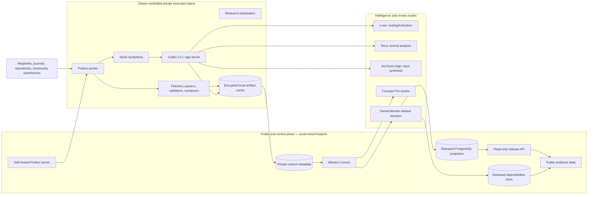

# AskRigor + InnerSignal Commons — Health Research Compute Fabric

**Status:** Proposed architecture; iteration/decision evidence, not purchase or deployment authorization  
**Date:** 2026-08-30  
**Assurance lane:** Decision, then bounded Iteration  
**Extends:** Mission Control + Symphony architecture on `architecture/codex-pro-supervision-mission-control-20260830`

## 1. Owner outcome

Build a durable, affordable compute architecture capable of supporting a significant public map of health research for AskRigor and a rigorously separated community-experience layer for InnerSignal Commons.

The architecture must:

- exploit the owner's ChatGPT/Codex subscription where legitimately supported rather than defaulting every model call to metered API inference;
- support long-running, resumable, auditable research programs rather than fragile chat sessions;
- preserve source, method, transformation, model, reviewer, and release provenance;
- keep public serving infrastructure independent from the owner's private execution workstation;
- scale from one machine to multiple runners without redesigning research contracts;
- reserve highest-intelligence review for decisions where it changes scientific or safety conclusions;
- prevent community reports, mechanistic hypotheses, research findings, and treatment claims from being collapsed into one evidentiary category;
- avoid a premature server rack, GPU purchase, graph database, Kubernetes cluster, or bespoke workflow engine.

## 2. Frozen independent conception snapshot

Preserved before the existing-work scan:

```text
Problem
A very large volume of long-running AskRigor and InnerSignal Commons research must be performed economically, with GPT subscription access preferred over API billing.

Candidate mechanism
Use one or more owner-controlled computers as private GPT/Codex research workers; keep a public map and durable coordination state in the cloud; add machines only as measured bottlenecks appear.

Constraints
- GPT inference is supplied by OpenAI rather than computed by the local CPU/GPU.
- Personal-account use must remain owner-controlled and must not become a shared public inference service.
- Research must be resumable, provenance-preserving, scientifically reviewed, and safe to publish.
- Public infrastructure cannot depend on an exposed home computer or a live browser session.

Candidate insight
Separate the public/control plane from the private execution plane. Treat model calls as one activity in a reproducible research workflow, not as the workflow itself. Scale durable work units, evidence records, and review gates before scaling hardware.
```

## 3. Bounded existing-work scan

### 3.1 Agentic work orchestration

**OpenAI Symphony** already provides issue-driven dispatch, isolated workspaces, continuous agent execution, retries/restarts, and a higher-level control-plane pattern.

Disposition: **REUSE**, not fork. Symphony owns Codex-oriented task dispatch and workspace lifecycle. Mission Control observes and governs it rather than reimplementing it.

References:

- https://github.com/openai/symphony
- https://openai.com/index/open-source-codex-orchestration-symphony/

### 3.2 Durable deterministic/data workflows

The research map contains many operations that are not agentic reasoning: source harvesting, identity reconciliation, deduplication, checksum generation, parsing, schema validation, scheduled surveillance, cache reuse, transformations, exports, and release projection.

Mature options reviewed:

| System | Strength | Decision |
|---|---|---|
| Prefect | Python-native flows, retries, caching, state/recovery, workers, self-hosted server/PostgreSQL, portable local-to-cloud execution | **ADAPT for pilot** |
| Temporal | Strongest durable execution for long-running, failure-prone, human-in-loop applications | **DEFER as scale baseline**; operationally heavier than the pilot needs |
| Dagster | Excellent asset lineage, observability, partitions, and testability | **COMPARATIVE ALTERNATIVE** if the system becomes predominantly asset-oriented |
| Nextflow | Reproducible, portable scientific/HPC pipelines | **INCOMPATIBLE AS PRIMARY ENGINE** for literature/agent workflows; retain for future computational-biology subpipelines |
| Bespoke queue/state machine | Maximum control but recreates solved retry, scheduling, cache, and recovery problems | **REJECT** |

Pilot decision: self-host **Prefect** for deterministic research pipelines and owner-controlled model activities. Preserve an orchestration adapter boundary so Temporal can replace it if measured durability or long-lived human-wait requirements exceed Prefect's practical envelope.

References:

- https://docs.prefect.io/v3/concepts/server
- https://docs.prefect.io/v3/concepts/caching
- https://temporal.io/
- https://docs.dagster.io/
- https://nextflow.io/

### 3.3 Evidence mapping and living synthesis

Evidence-and-gap maps, mega-maps, living systematic reviews, continuously updated trial databases, and semi-automated review tooling are established bodies of work.

What is substantially solved:

- systematic mapping of where evidence exists;
- recurring surveillance and update workflows;
- semi-automated screening and extraction;
- interactive public presentation;
- human-in-loop review production.

What remains partial:

- interoperability across review stages and tools;
- reliable machine-readable trial results and methods;
- deep, versioned study appraisal in continuously updated databases;
- public explanation of what conclusions methods can and cannot support;
- contradiction and dependency mapping across studies, reviews, claims, and updates;
- sustainable human oversight and update prioritization.

Disposition: **ADAPT** Campbell/WHO evidence-map methods and living-review practices; do not claim the idea of a public evidence map is novel. AskRigor's candidate novel remainder is the method-aware, versioned claim/evidence graph, contradiction handling, access-boundary preservation, reusable audit records, and decision-specific explanation layer.

### 3.4 Provenance and research packaging

**W3C PROV** supplies a standard model for entities, activities, agents, derivation, attribution, versioning, and provenance exchange. **RO-Crate** supplies a lightweight JSON-LD package for research objects, metadata, workflow context, authorship, inputs, outputs, and provenance.

Disposition: **REUSE/ADAPT**. Do not invent a private provenance ontology first. Internal records may be optimized for PostgreSQL, but released research packages must have a deterministic W3C-PROV-compatible and RO-Crate export.

References:

- https://www.w3.org/TR/prov-overview/
- https://www.researchobject.org/ro-crate/

## 4. Explicit build decision

```text
REUSE       Symphony for Codex task dispatch and isolated workspaces
ADAPT       Prefect for durable deterministic research workflows and private workers
REUSE       PostgreSQL for canonical operational and research state
REUSE       S3-compatible object storage for immutable artifacts
ADAPT       Campbell/WHO evidence-map and living-review methodology
REUSE       W3C PROV + RO-Crate for exchangeable provenance/packages
COMPOSE     Mission Control across Symphony, Prefect, model/reviewer lanes, and releases
INVENT      Only the AskRigor-specific claim/evidence/appraisal/contradiction/release model
EXPERIMENT  Subscription-runner throughput, model routing, audit accuracy, and human-review burden
DEFER       Temporal, graph database, Kubernetes, rack hardware, and local large-model GPUs
```

## 5. Recommended topology



### 5.1 Public/control plane

Keep online continuously but computationally light:

- Prefect server/API and PostgreSQL state;
- Mission Control event ingestion and dashboard;
- task contracts, heartbeats, artifact references, and resource ledger;
- released-data PostgreSQL projection;
- released object storage;
- public Next.js atlas and narrow read-only API;
- monitoring, encrypted backups, and outbound notifications.

No ChatGPT session cookie, Codex auth token, browser profile, unrestricted repository credential, private community record, or unreleased health interpretation belongs here unless the environment is specifically secured for that secret and the use is supported.

### 5.2 Private execution plane

The workstation polls outward for authorized work. It does not need public inbound access.

It runs:

- Prefect worker processes;
- stock Symphony for agentic task/workspace lifecycle;
- Codex CLI/app server through official scriptable interfaces;
- isolated Git worktrees/containers;
- PDF/text parsers and deterministic validation;
- local cache for permitted source files and generated artifacts;
- optional local embedding, deduplication, and classification models;
- encrypted credential storage and owner-only browser profiles when a source genuinely requires them.

### 5.3 Two different kinds of orchestration

Do not force every operation through Symphony.

**Prefect owns data/research pipeline state:**

```text
surveil -> retrieve -> identify -> deduplicate -> parse -> validate
-> enqueue semantic work -> import structured result -> cross-check
-> assemble evidence object -> review gate -> release projection
```

**Symphony owns open-ended agentic work:**

```text
research task/issue -> isolated workspace -> Codex run/continuation
-> proof packet -> Mission Control -> reviewer decision
```

Mission Control normalizes events from both and owns neither scheduler.

## 6. Personal-subscription boundary

### 6.1 What the computer does and does not buy

A stronger workstation does **not** run GPT-5.6 inference locally. OpenAI supplies the model computation. Local hardware buys:

- more simultaneous isolated workspaces and containers;
- faster parsing, local search, deduplication, indexing, checksums, and tests;
- more browser contexts when genuinely required;
- larger artifact caches and databases;
- better reliability, recovery, and unattended non-model work.

The limiting resource may therefore be the subscription allowance, source-access rate limits, or human review—not CPU.

### 6.2 Supported route

ChatGPT Pro includes Codex CLI and scriptable workflows such as `codex exec`. Use the official CLI/app-server interfaces, machine-readable JSONL, and JSON-schema outputs. Never build the research fabric by scraping or remotely driving the ChatGPT website.

A private remote VM can be used as a personally controlled workstation after an owner login, but the stronger trusted-automation access-token feature is not shown for Plus/Pro. Personal-account authentication must therefore not be treated as an enterprise-grade unattended credential service or the sole production SLA.

Rules:

- only the owner uses the account;
- keep `~/.codex/auth.json` password-equivalent and outside repositories;
- never execute untrusted public-repository code in the credential-bearing environment;
- never expose subscription-backed model execution directly to public users;
- local and cloud Codex work share plan limits;
- keep an API-budgeted overflow lane for time-critical, public, multi-user, or SLA-bound work;
- record observed plan availability separately from local estimates.

## 7. Hardware recommendation

### 7.1 Buy one tower, not a rack

Recommended first dedicated machine:

```text
CPU        16–24 strong modern CPU cores or equivalent
RAM        128 GB preferred; 64 GB is a workable minimum pilot
System     2 TB NVMe for OS, containers, worktrees, and databases
Artifacts  4 TB NVMe for hot corpus/artifacts; expand with bulk storage later
GPU        none required initially; basic display capability is sufficient
Network    reliable wired Ethernet; private outbound tunnel/overlay as needed
Power      UPS with clean shutdown and automatic service restart
OS         Linux, containers, encrypted disks, monitored SMART/health
```

Rationale:

- CPU/RAM, not GPU, determine local worker density for this design;
- 128 GB supports multiple parsers, browsers, containers, PostgreSQL, and workers without memory pressure;
- NVMe reduces contention across many small files, repositories, indexes, and PDFs;
- a tower is easier to cool, maintain, move, and power than a rack;
- a modern tower is a single replaceable execution node, not the canonical database or public service.

### 7.2 Optional small reliability node

A low-power mini PC or the existing machine may run local monitoring, encrypted backup coordination, and emergency control. This is optional because the preferred control plane is already in the cloud.

### 7.3 Do not buy a large GPU yet

A GPU becomes justified only after a benchmark proves that a local model can safely replace a material volume of Luna/Terra work for a bounded task such as:

- title/abstract screening;
- citation deduplication;
- structured extraction with verification;
- embedding generation;
- low-risk routing/classification.

Benchmark against the strongest subscription baseline on recall, false exclusion, extraction error, calibration, throughput, energy, and human correction time. Purchase VRAM for a validated workload, not for a hypothetical future model.

### 7.4 Rack trigger

Consider multiple physical servers or a rack only when at least one measured condition holds:

- more than roughly 16 heavy local sandboxes remain runnable while model allowance is still available;
- a validated local-model lane needs multiple GPUs;
- the permitted hot corpus grows beyond roughly 10–20 TB;
- one execution node creates unacceptable downtime despite cloud-held canonical state;
- deterministic/OCR/computational workloads, rather than GPT waiting, dominate queue delay;
- independent security zones require physically separate workers.

These are engineering heuristics, not purchase commitments.

## 8. Storage and knowledge architecture

### 8.1 Canonical stores

Use:

- **PostgreSQL** for canonical entities, relationships, state, release decisions, and append-only event references;
- **S3-compatible object storage** for source snapshots where retention is permitted, parsed text, extraction packets, audit artifacts, model outputs, and RO-Crates;
- **content-addressed identifiers/checksums** for immutable artifacts;
- **PostgreSQL full-text search first**, with optional local embeddings;
- a **released projection** physically/logically separated from private operations.

Do not start with Neo4j or another graph database. Represent edges in PostgreSQL. Add a graph engine only after real queries demonstrate that relational recursive queries and materialized projections are inadequate.

### 8.2 Core object hierarchy

```text
research_program
  -> work_package
    -> task_contract
      -> run
        -> activity
          -> artifact
          -> structured_result
          -> claim
          -> evidence_relation
          -> review
          -> release_decision
```

Health knowledge entities include:

```text
source record
publication/work/version
study/trial/cohort
registry entry
intervention/exposure/comparator
population/context
outcome/measurement/timepoint
result/estimate
method appraisal
claim
synthesis
contradiction/dependency
access boundary
uncertainty/limitation
release/version/supersession
```

### 8.3 Research and community evidence must remain distinct

**AskRigor research layer:** published studies, registries, protocols, datasets, reviews, guidelines, audits, retractions/corrections, methods, results, and claim-support relations.

**InnerSignal Commons experience layer:** opt-in personal reports, context, timing, perceived effects, adverse effects, uncertainty, co-interventions, and consent/release state.

Connections may be displayed, but the system must never silently promote community prevalence or vividness into causal research evidence. Aggregate signals can nominate research questions and surveillance priorities.

Private identifiable submissions stay in a separate access-controlled store. Only consented, reviewed, appropriately transformed projections reach the public atlas.

## 9. Model and reviewer routing

Default routing target:

```text
Deterministic code  source identity, checksums, parsers, dedupe, schema checks,
                    arithmetic, citation graph operations, release validation

Luna               high-volume routing, classification, first-pass extraction,
                    candidate clustering, inexpensive background tasks

Terra               ordinary document analysis, structured appraisal drafts,
                    reconciliation, reporting, code/research tasks requiring judgment

Sol Extra High      difficult synthesis, ambiguous methods, contradiction analysis,
                    architecture, protocol interpretation, hard error investigation

Focused Pro         material AskRigor conclusion validity, methodological defects,
                    evidence sufficiency, protocol conflict, access boundaries;
                    material InnerSignal technique/safety/relational semantics

Fresh Pro           independent adjudication where contamination or independence matters

Human release       public conclusions, consequential health/safety language,
                    unresolved disagreement, privacy/consent, policy changes
```

Do not set fixed percentages as truth before telemetry. A pilot design target is to push the majority of volume into deterministic/Luna lanes while protecting recall and escalating uncertainty rather than hiding it.

## 10. Research job contract

Every long-running task is a durable job, not a chat transcript.

Minimum contract:

```yaml
job_id: ...
program_id: ...
objective: ...
question_schema: ...
source_scope: ...
search_version: ...
protocol_versions: ...
input_artifact_hashes: []
required_output_schema: ...
model_route: ...
allowed_tools: []
access_and_privacy_class: ...
retry_policy: ...
checkpoint_policy: ...
review_triggers: []
release_gate: ...
stop_conditions: []
```

Codex jobs use `codex exec --json` or app-server events and an explicit output schema. Capture thread/run identity, usage, tool events, artifact hashes, and terminal state. Resume the same durable job when appropriate rather than restarting from a prose summary.

## 11. Reliability and security rules

- Public serving never depends on the workstation being online.
- Canonical state is replicated/backed up off the execution machine.
- Private workers pull jobs outbound; no broad inbound port exposure.
- Credentials and source-access cookies are never committed.
- Model-bearing workers do not execute untrusted code.
- Research fetching, repository mutation, and publication credentials use separate least-privilege identities.
- Every activity is idempotent or records why it cannot be retried safely.
- Artifacts are immutable; corrections create new versions and supersession edges.
- No model output publishes directly.
- Release projections are rebuilt deterministically from approved versions.
- Community-private and therapy-sensitive data never enter public logs, GitHub, or general model packets without explicit governed transformation.

## 12. Pilot before hardware scaling

Use the current computer first to measure the workflow, then procure the tower if the measured local bottleneck warrants it. The existing machine is not expected to be the final execution host; it is sufficient to establish telemetry and prevent buying the wrong architecture.

Pilot scope consistent with the public-atlas plan:

- 3 bounded health topics/conditions;
- 25–50 candidate public findings;
- one Prefect instance and one worker initially;
- stock Symphony for one agentic lane;
- Mission Control ingestion from both;
- deterministic import, identity, provenance, and release schemas;
- Luna/Terra/Sol routing comparison on a fixed regression set;
- a small number of focused Pro judgments on genuinely material decisions;
- read-only public projection with no autonomous publishing.

Measure:

```text
candidate records discovered
unique studies after identity resolution
per-stage throughput and queue time
CPU/RAM/disk/network utilization
source-access failure rate
Codex messages/allowance observations per accepted artifact
retries and resumed runs
structured-output validation failures
false exclusion / missed-study rate on a known set
extraction and appraisal error rate
human review minutes per released finding
Pro decisions that changed the outcome
cost per released, maintained finding
```

## 13. Scale decisions

### Add the dedicated tower when

- the pilot shows local memory/CPU/disk contention materially delaying work;
- the job contracts and recovery model are stable enough that migration is mechanical;
- subscription allowance remains available while local workers are queued;
- the public/released projection is already independent from the machine.

### Add a second runner when

- queue delay is caused by local execution rather than model allowance;
- one node cannot provide acceptable recovery;
- workload classes need security or resource isolation;
- independent parsing/OCR/indexing work can continue while agent jobs wait.

### Add API inference when

- public users trigger real-time work;
- an SLA or scheduled deadline cannot depend on a personal login;
- owner subscription limits block high-priority work;
- organizational access, audit, isolation, or service credentials are required;
- measured API cost is justified by outcome value.

### Consider Temporal when

- workflows routinely remain open for weeks/months awaiting human/external events;
- restart/replay correctness becomes a primary operational risk;
- cross-service compensation and durable signals/timers dominate the workflow;
- Prefect recovery requires increasing bespoke state/reconciliation code.

## 14. Rejected first moves

- **Small rack now:** increases capital, heat, power, maintenance, and failure surface without increasing GPT allowance.
- **Cloud GPU servers:** pay for unused local inference capacity when GPT remains remote.
- **Browser farm driving ChatGPT web:** fragile, noncanonical, hard to audit, and the wrong interface for automation.
- **API-only from day one:** unnecessarily expensive for owner-initiated batch research before throughput/value is measured.
- **Personal subscription as public backend:** unsupported operating boundary and no reliable service isolation/SLA.
- **Kubernetes now:** complexity without a demonstrated scheduling need.
- **Graph database now:** premature; relational edge tables and projections are sufficient for the pilot.
- **One giant autonomous research agent:** unrecoverable context, weak provenance, duplicated retrieval, and review bottlenecks.
- **One Pro chat per worker:** spends scarce attention/model capacity on status rather than decisions.

## 15. Smallest next implementation slice

1. Add a `research-job.schema.json` and immutable artifact manifest.
2. Stand up self-hosted Prefect with PostgreSQL in a private development environment.
3. Implement one deterministic flow: retrieve known corpus -> identity/dedupe -> parse -> checksum -> artifact manifest.
4. Add one model activity invoking official Codex scripting with JSONL events and a strict output schema.
5. Feed normalized Prefect/Codex events into Mission Control.
6. Produce one W3C-PROV-compatible RO-Crate from the run.
7. Import only a human-approved projection into a tiny read-only atlas.
8. Run the fixed pilot telemetry before purchasing rack/GPU infrastructure.

No rack, GPU, Kubernetes, graph database, autonomous publishing, or broad corpus ingestion is authorized by this proposal.