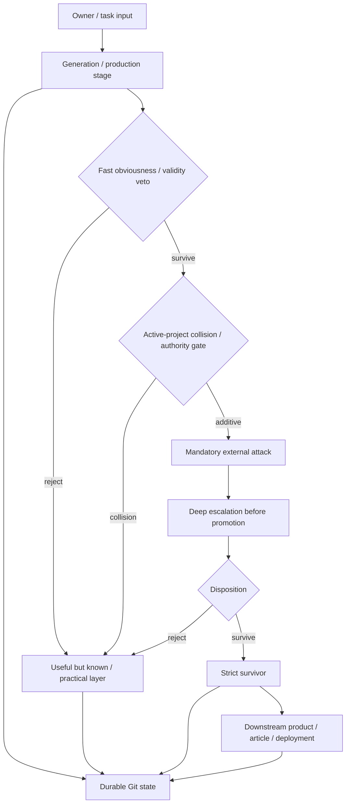

# Living Mermaid workflow maps

Status: reusable cross-project architecture pattern
Promoted from: `u-dont-existDOTcom/communities` + `u-dont-existDOTcom/creativeTailSampling`
Date: 2026-08-16

## Rule

For a long-running workflow with multiple gates, repositories, provider calls, durable artifacts, or feedback loops, maintain a **source-controlled Mermaid architecture map beside the prose state**.

The map is an operational control surface, not decoration. A fresh worker should be able to see the current end-to-end path, major decision gates, authoritative artifacts, persistence boundaries, and feedback loops without reconstructing them from many text files.

## When this pattern is required

Add a living Mermaid map when at least one of these is true:

- the workflow has three or more consequential stages or gates;
- work spans multiple repositories or external providers;
- different branches have different authority roles;
- the same artifact can be rejected, narrowed, escalated, promoted, or routed elsewhere;
- retrieval/evaluation providers have distinct mandatory versus optional roles;
- article/product output depends on a research or evidence pipeline;
- context loss or fresh-conversation recovery is a meaningful operational risk.

## Architecture

Use **overview + drill-down**, not one giant graph.

1. **Overview diagram** — the complete workflow from owner/input to final output.
2. **Gate drill-down** — the most consequential evaluation/promotion/approval logic.
3. **Persistence/dataflow drill-down** — where evidence, state, artifacts, and checkpoints live.
4. Optional domain-specific diagrams only when they reduce ambiguity.

The overview should normally fit on one screen in GitHub. If it does not, split it.

## Canonical properties

A useful map should make these explicit:

- what is generated without external anchoring;
- where obvious/common candidates are rejected;
- where the active project corpus is checked;
- which external evaluators are mandatory, optional, or escalation-only;
- what `reject`, `narrow`, `survive`, and `practical-only` mean;
- what may be shown provisionally versus what requires full validation;
- where durable state is written;
- which artifact governs the next stage;
- what owner corrections feed back into;
- where an editorial/publication phase begins and whether it is authorized.

## Authority rule

The Mermaid map **does not replace** canonical prose/evidence artifacts.

Treat it as a visual index over authoritative state. Each major node should point conceptually to a real artifact, command, provider, or decision. If the graph and canonical state conflict, repair the graph immediately; do not silently use the graph as higher authority.

## Update triggers

Update the map in the same change whenever any of these materially change:

- control-flow topology;
- promotion/rejection rules;
- provider roles;
- required verification or paid-escalation gates;
- authoritative files/repositories;
- persistence/checkpoint paths;
- branch roles;
- handoff from research to editing, deployment, publication, or another phase;
- a newly discovered failure mode creates a real feedback loop.

Cosmetic wording changes do not require graph churn.

## Mermaid template

Adapt labels and topology to the actual project; do not force every workflow into this exact shape.

## Validation

Before calling the map complete:

- verify every node represents a real stage/artifact rather than aspirational prose;
- verify arrows match actual execution order;
- verify mandatory versus optional gates are visually distinguishable in labels;
- verify rejection/narrowing loops are present where they exist;
- verify the graph is readable in GitHub Mermaid rendering;
- verify canonical text indexes the map so fresh workers can find it;
- verify the map names the current authoritative state rather than stale filenames or branches.

Where CI/tooling makes it cheap, render Mermaid automatically to catch syntax errors. A renderer check validates syntax only; it does not validate semantic correctness.

## Anti-patterns

### Mega-graph

A graph containing every script, helper, test, and file becomes less useful than prose. Keep the overview structural and move detail into drill-downs.

### Decorative diagram

A diagram that is not linked from the project index and not updated with workflow changes will drift. Either make it part of the maintenance contract or do not rely on it.

### Duplicate canonical graphs

Do not copy the full graph into several repositories. Maintain one canonical project-specific map and use small pointers elsewhere. Duplication creates silent topology drift.

### Hidden gate changes

Do not change an evaluation/provider role in prose or code without updating the map in the same change when the difference is operationally material.

### Visual authority inflation

A clean diagram can make an unvalidated process look more settled than it is. Keep epistemic labels such as `provisional`, `mandatory`, `optional`, `research-only`, or `editorial-authorized` where they matter.

## Provenance and transferable lesson

This pattern was promoted after a communities-research workflow accumulated multiple interacting layers: retrieval-free Creative Tail generation, user-obviousness rejection, active-project corpus collision, Exa routine novelty attack, Parallel Task deep attack, evidence synthesis, practical-only lessons, article-gap comparison, and GitHub-first durability. The text artifacts were individually adequate but no longer gave a fast global view of control flow.

Transferable lesson: **once a workflow becomes a graph, maintain the graph explicitly.** Prose remains the authority for detail, but a living source-controlled Mermaid map reduces recovery cost, prevents hidden gate drift, and makes cross-repository/provider architecture inspectable.
